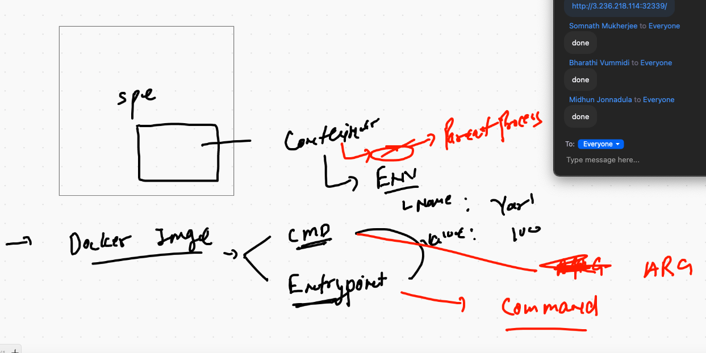

# Docker & k8s

## cleaning up 

```
 2437  kubectl delete all  --all
 2438  clear
❯ kubectl  get  po
No resources found in default namespace.
❯ kubectl  get  svc
NAME         TYPE        CLUSTER-IP   EXTERNAL-IP   PORT(S)   AGE
kubernetes   ClusterIP   10.96.0.1    <none>        443/TCP   41s

```

## POD with svc 

### POD

```
kubectl  run  ashuwebapp --image=dockerashu/oracleweb:appv001  --port 80 --dry-run=client -o yaml >ashweb.yml
```

## file with comments

```
❯ cat  ashweb.yml
apiVersion: v1
kind: Pod
metadata:
  creationTimestamp: null
  labels:  # to define pod label 
    run: ashuwebapp  # run is a key and ashuwebapp is a value 
  name: ashuwebapp  # name of the POD 
spec:
  containers:
  - image: dockerashu/oracleweb:appv00  # image from docker HUB 1
    name: ashuwebapp  # container name 
    ports:
    - containerPort: 80  # application port 
    resources: {}
  dnsPolicy: ClusterFirst
  restartPolicy: Always
status: {}


```
## TO add service definition in the same file

```
kubectl create service nodeport ashusvc1 --tcp 1234:80 --dry-run=client -o yaml  >>ashweb.yml

```

## POD with SVC file 

```
❯ cat ashweb.yml
apiVersion: v1
kind: Pod
metadata:
  creationTimestamp: null
  labels:  # to define pod label 
    run: ashuwebapp  # run is a key and ashuwebapp is a value 
  name: ashuwebapp  # name of the POD 
spec:
  containers:
  - image: dockerashu/oracleweb:appv00  # image from docker HUB 1
    name: ashuwebapp  # container name 
    ports:
    - containerPort: 80  # application port 
    resources: {}
  dnsPolicy: ClusterFirst
  restartPolicy: Always
status: {}

# to add another file definition 
---
apiVersion: v1
kind: Service
metadata:
  creationTimestamp: null
  labels:  # label of service 
    app: ashusvc1
  name: ashusvc1  # name of service 
spec:
  ports:
  - name: 1234-80
    port: 1234  # port of service  
    protocol: TCP
    targetPort: 80  # port of pod running app 
  selector:  # here we need to assign same label as pod 
   run: ashuwebapp  # label of POD 
  type: NodePort  # type of service 
status:
  loadBalancer: {}
  
 ```
  
###
```
❯ kubectl apply -f ashweb.yml
pod/ashuwebapp created
service/ashusvc1 created
❯ kubectl get  po,svc
NAME             READY   STATUS    RESTARTS   AGE
pod/ashuwebapp   1/1     Running   0          10s

NAME                 TYPE        CLUSTER-IP       EXTERNAL-IP   PORT(S)          AGE
service/ashusvc1     NodePort    10.106.177.198   <none>        1234:32626/TCP   9s

```

## ENV in POD 

```
spec:
  containers:
  - image: dockerashu/oracleweb:appv001  # image from docker HUB 1
    name: ashuwebapp  # container name
    env:
     - name: deploy
       value: app1
       
 ```
 
 ## replacing env 
 
 ```
 ❯ kubectl replace -f ashweb.yml --force
pod "ashuwebapp" deleted
service "ashusvc1" deleted
pod/ashuwebapp replaced
service/ashusvc1 replaced
❯ vim ashweb.yml
❯ kubectl get svc
NAME         TYPE        CLUSTER-IP       EXTERNAL-IP   PORT(S)          AGE
amarsvc1     NodePort    10.109.240.157   <none>        3241:30335/TCP   27m
ashoksvc1    NodePort    10.101.245.246   <none>        1234:32031/TCP   28m
ashusvc1     NodePort    10.98.1.162      <none>        1234:32339/TCP   12s
bvwebsvc1    NodePort    10.104.126.206   <none>        4581:31767/TCP   3m54s
harisvc1     NodePort    10.98.157.174    <none>        1236:32458/TCP   4m31s
kubernetes   ClusterIP   10.96.0.1        <none>        443/TCP          33m

```

## ENV and parent process in POD file 



## Pod with parent process

```
❯ cat al.yml
apiVersion: v1
kind: Pod
metadata:
  creationTimestamp: null
  labels:
    run: ashupod3
  name: ashupod3
spec:
  containers:
  - image: alpine
    name: ashupod3
    command: ["/bin/sh","-c","ping google.com"]  # to replace entrypoint based parent proces
    resources: {}
  dnsPolicy: ClusterFirst
  restartPolicy: Never
status: {}

```

## Logs of running pod

```
  kubectl logs -f   ashupod3
  
```
## accessing container 

```
❯ kubectl exec -it ashupod3  sh
kubectl exec [POD] [COMMAND] is DEPRECATED and will be removed in a future version. Use kubectl exec [POD] -- [COMMAND] instead.
/ # 
/ # 
/ # 
/ # %                                                                                                                         ❯ 
❯ kubectl exec -it ashupod3  -- sh
/ # 
/ # 
/ # cat  /etc/os-release 
NAME="Alpine Linux"
ID=alpine
VERSION_ID=3.12.3
PRETTY_NAME="Alpine Linux v3.12"
HOME_URL="https://alpinelinux.org/"
BUG_REPORT_URL="https://bugs.alpinelinux.org/"

```

