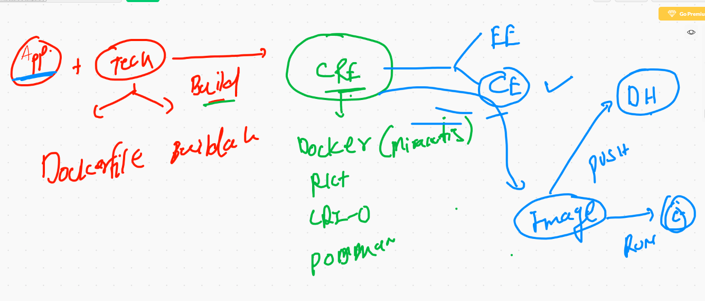
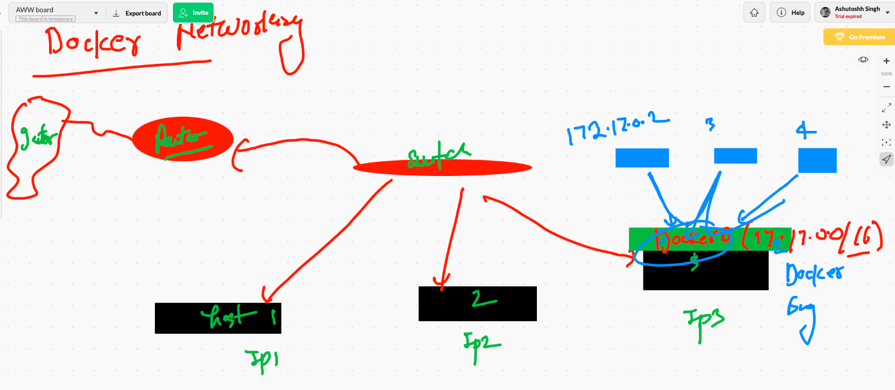
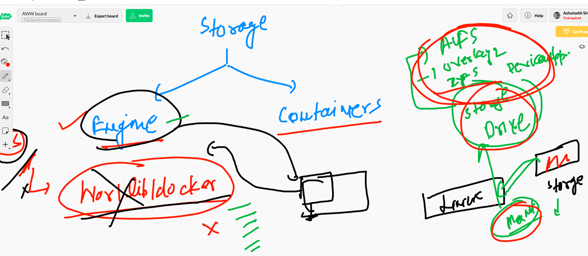
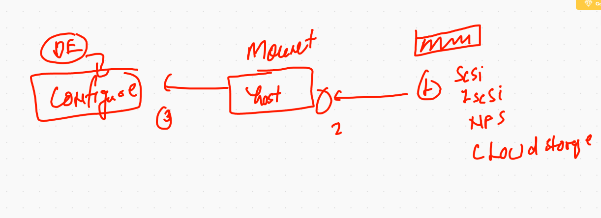
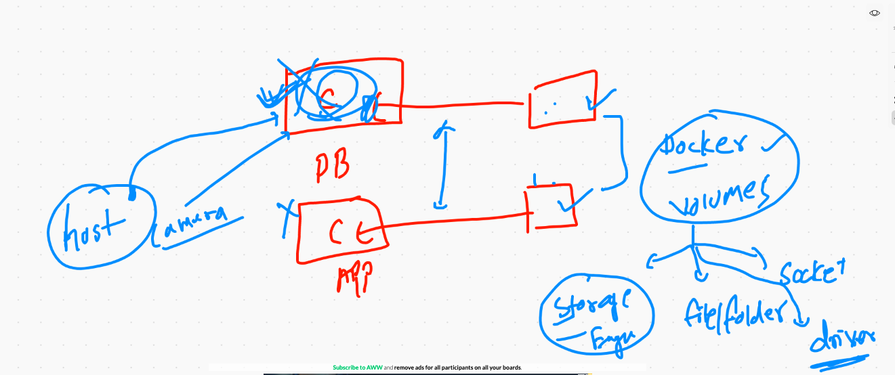
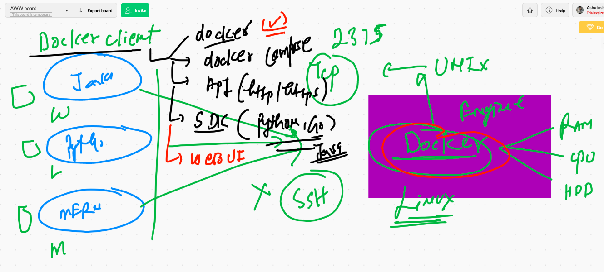
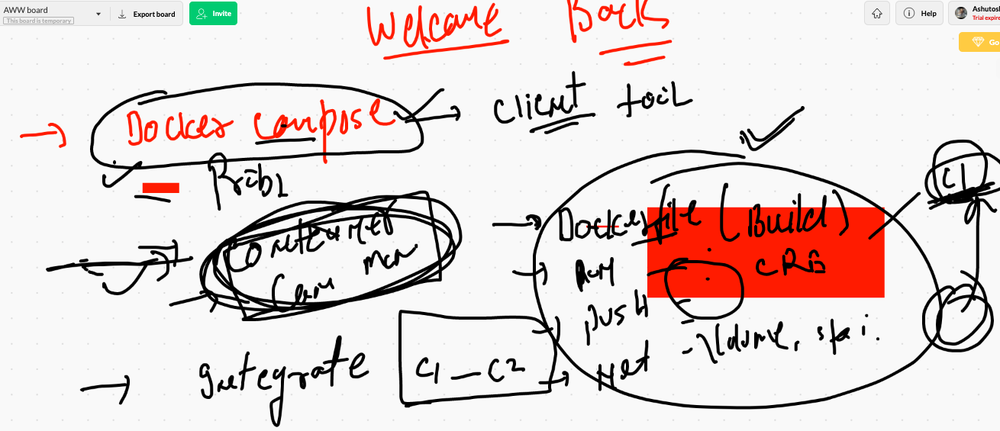
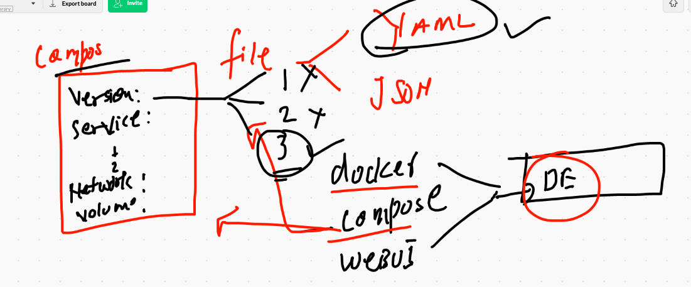

# Docker & k8s

## Day1 rev



## Dockerfile with arg 

```
[ec2-user@ip-172-31-66-188 test]$ cat Dockerfile 
FROM centos
MAINTAINER  ashutoshh
ARG x=httpd
RUN  yum install vim $x -y
RUN  echo "Hello world"  >/var/www/html/index.html 
EXPOSE 80
ENTRYPOINT ["httpd","-DFOREGROUND"]
```

## running dockerfile 

```
 313  docker  build -t  ashu:testv1  . 
  314  docker  build --build-arg x=ftp   -t  ashu:testv1  . 
  
```

## arg variable scope is not to the container 

```
[ec2-user@ip-172-31-66-188 test]$ docker run --rm -it  --entrypoint bash   ashu:testv1  
[root@d9f7cc6afdad /]# 
[root@d9f7cc6afdad /]# env
LANG=en_US.UTF-8
HOSTNAME=d9f7cc6afdad
PWD=/
HOME=/root
TERM=xterm
SHLVL=1
PATH=/usr/local/sbin:/usr/local/bin:/usr/sbin:/usr/bin:/sbin:/bin
LESSOPEN=||/usr/bin/lesspipe.sh %s
_=/usr/bin/env


```

## arg and env 

```
[ec2-user@ip-172-31-66-188 test]$ cat  Dockerfile 
FROM centos
MAINTAINER  ashutoshh
ARG x=httpd
ENV y=$x
RUN  yum install vim $y -y
RUN  echo "Hello world"  >/var/www/html/index.html 
EXPOSE 80
ENTRYPOINT ["httpd","-DFOREGROUND"]


```

# multi app 

## dockerfile 

```
[ec2-user@ip-172-31-66-188 multiapp]$ cat Dockerfile 
FROM oraclelinux:7.9
MAINTAINER ashutoshh@linux.com
ARG software=httpd
RUN yum install $software  -y
ENV deploy=app
RUN mkdir /client  /client/app1  /client/app2  /client/app3
COPY app1  /client/app1/
COPY app2  /client/app2/
COPY app3  /client/app3/
COPY startapp.sh  /client/startapp.sh
WORKDIR  /client
RUN chmod +x startapp.sh
EXPOSE 80
ENTRYPOINT  ["./startapp.sh"] 

```

## shell script 

```
[ec2-user@ip-172-31-66-188 multiapp]$ cat startapp.sh 
#!/bin/bash 


if  [ "$deploy"  ==  "app1" ]
then
	cp -rf  /client/app1/*    /var/www/html/
	httpd -DFOREGROUND 

elif  [ "$deploy"  ==  "app2" ]
then
	cp -rf  /client/app2/*    /var/www/html/
	httpd -DFOREGROUND 


elif  [ "$deploy"  ==  "app3" ]
then
	cp -rf  /client/app3/*    /var/www/html/
	httpd -DFOREGROUND 


else 

	echo "You variable is not correct"    >/var/www/html/index.html 
	httpd -DFOREGROUND 

fi

```


## building docker image

```
 docker build  -t  dockerashu/oracleweb:appv001 .
 ```
 
 ## deployment of containers
 
 ```
  368  docker run -d --name ashuxx12 -p 8811:80 -e deploy=app1 dockerashu/oracleweb:appv001
  369  docker  ps
  370  curl http://ipinfo.io/json 
  371  docker run -d --name ashuxx13 -p 8800:80 -e deploy=app2 dockerashu/oracleweb:appv001
  372  docker run -d --name ashuxx13 -p 8888:80 -e deploy=app3 dockerashu/oracleweb:appv001
  373  docker run -d --name ashuxx15 -p 8888:80 -e deploy=app3 dockerashu/oracleweb:appv001
  
  ```
  
  ## memory and cpu limits
  
  ```
  143  docker  stats   ashuxx15
  144  docker  stats   
  145  history 
  146  docker  update  ashuxx15 --memory=100M 
  147  docker  update  --help
  148  free  -m
  149  history 
  150  docker  run -d --name cc33 --memory 400m alpine ping fb.com 
  151  docker  stats cc33
  152  history 
[raj@ip-172-31-66-188 multiapp]$ docker  run -d --name cc33 --memory 400m --cpu-share=30 alpine ping fb.com 

```

# Docker networking 



```
[ec2-user@ip-172-31-66-188 ~]$ docker  network  ls
NETWORK ID          NAME                DRIVER              SCOPE
e7932d9006fa        bridge              bridge              local
c090dd9621f7        host                host                local
2193e4221c29        none                null                local
[ec2-user@ip-172-31-66-188 ~]$ ifconfig  docker0
docker0: flags=4163<UP,BROADCAST,RUNNING,MULTICAST>  mtu 1500
        inet 172.17.0.1  netmask 255.255.0.0  broadcast 172.17.255.255
        inet6 fe80::42:e6ff:fed8:3d5a  prefixlen 64  scopeid 0x20<link>
        ether 02:42:e6:d8:3d:5a  txqueuelen 0  (Ethernet)
        RX packets 40023  bytes 9554173 (9.1 MiB)
        RX errors 0  dropped 0  overruns 0  frame 0
        TX packets 61162  bytes 664981507 (634.1 MiB)
        TX errors 0  dropped 0 overruns 0  carrier 0  collisions 0
```

## docker bridge details 

```
[ec2-user@ip-172-31-66-188 ~]$ docker network inspect bridge 
[
    {
        "Name": "bridge",
        "Id": "e7932d9006fa64b1ee2fea7606a7cbae6072470652b62c18168597c1189431d4",
        "Created": "2020-12-17T03:55:48.674034918Z",
        "Scope": "local",
        "Driver": "bridge",
        "EnableIPv6": false,
        "IPAM": {
            "Driver": "default",
            "Options": null,
            "Config": [
                {
                    "Subnet": "172.17.0.0/16",
                    "Gateway": "172.17.0.1"
                }

```
## creating new bridge

```
[ec2-user@ip-172-31-66-188 ~]$ docker network create  ashubr1 
5e6007b32680db9466a7f4d4c656706adc83b96d8ea1a06f770538db34ef863c
[ec2-user@ip-172-31-66-188 ~]$ docker network ls
NETWORK ID          NAME                DRIVER              SCOPE
5e6007b32680        ashubr1             bridge              local
e7932d9006fa        bridge              bridge              local
c090dd9621f7        host                host                local

```
## inspecting 

```
[ec2-user@ip-172-31-66-188 ~]$ docker network inspect   ashubr1 
[
    {
        "Name": "ashubr1",
        "Id": "5e6007b32680db9466a7f4d4c656706adc83b96d8ea1a06f770538db34ef863c",
        "Created": "2020-12-17T07:16:51.278233803Z",
        "Scope": "local",
        "Driver": "bridge",
        "EnableIPv6": false,
        "IPAM": {
            "Driver": "default",
            "Options": {},
            "Config": [
                {
                    "Subnet": "172.18.0.0/16",
                    "Gateway": "172.18.0.1"
                }

```

## attaching container in diff bridge

```
[ec2-user@ip-172-31-66-188 ~]$ docker  run -it --rm --network ashubr1 alpine sh 
/ # ifconfig 
eth0      Link encap:Ethernet  HWaddr 02:42:AC:12:00:02  
          inet addr:172.18.0.2  Bcast:172.18.255.255  Mask:255.255.0.0
          UP BROADCAST RUNNING MULTICAST  MTU:1500  Metric:1
          RX packets:11 errors:0 dropped:0 overruns:0 frame:0
          TX packets:0 errors:0 dropped:0 overruns:0 carrier:0
          collisions:0 txqueuelen:0 
          RX bytes:962 (962.0 B)  TX bytes:0 (0.0 B)

lo        Link encap:Local Loopback  
          inet addr:127.0.0.1  Mask:255.0.0.0
          UP LOOPBACK RUNNING  MTU:65536  Metric:1
          RX packets:0 errors:0 dropped:0 overruns:0 frame:0
          TX packets:0 errors:0 dropped:0 overruns:0 carrier:0
          collisions:0 txqueuelen:1000 
          RX bytes:0 (0.0 B)  TX bytes:0 (0.0 B)

/ # ping 172.17.0.2
PING 172.17.0.2 (172.17.0.2): 56 data bytes
^C
--- 172.17.0.2 ping statistics ---
3 packets transmitted, 0 packets received, 100% packet loss
/ # ping 172.17.0.3
PING 172.17.0.3 (172.17.0.3): 56 data bytes
^C
--- 172.17.0.3 ping statistics ---
2 packets transmitted, 0 packets received, 100% packet loss

```


## container with static ip 

```
[ec2-user@ip-172-31-66-188 ~]$ docker network create  ashubr2  --subnet 192.168.1.0/24 
efae21937a38a6ef298392257d0fff292803a75a81f5f3547f1e667837933c95
[ec2-user@ip-172-31-66-188 ~]$ 
[ec2-user@ip-172-31-66-188 ~]$ 
[ec2-user@ip-172-31-66-188 ~]$ docker run -d --name xc1 --network ashubr2 --ip 192.168.1.100 alpine ping fb.com 
8ad6053d2cb0315c8285b0f173bc60ee15f98ed6db7b566c9242eb850e41bac9
[ec2-user@ip-172-31-66-188 ~]$ docker run -d --name xc2 --network ashubr2 alpine ping fb.com 
7496b70cc098ce14cdb9ea3365ba1ebbdd29639f3eba24e8d4c85a08ed6c2ecb
[ec2-user@ip-172-31-66-188 ~]$ docker  exec -it xc2 sh 
/ # ifconfig 
eth0      Link encap:Ethernet  HWaddr 02:42:C0:A8:01:02  
          inet addr:192.168.1.2  Bcast:192.168.1.255  Mask:255.255.255.0
          UP BROADCAST RUNNING MULTICAST  MTU:1500  Metric:1
          RX packets:25 errors:0 dropped:0 overruns:0 frame:0
          TX packets:18 errors:0 dropped:0 overruns:0 carrier:0
          collisions:0 txqueuelen:0 
          RX bytes:2218 (2.1 KiB)  TX bytes:1588 (1.5 KiB)

lo        Link encap:Local Loopback  
          inet addr:127.0.0.1  Mask:255.0.0.0
          UP LOOPBACK RUNNING  MTU:65536  Metric:1
          RX packets:4 errors:0 dropped:0 overruns:0 frame:0
          TX packets:4 errors:0 dropped:0 overruns:0 carrier:0
          collisions:0 txqueuelen:1000 
          RX bytes:252 (252.0 B)  TX bytes:252 (252.0 B)

/ # ping 192.168.1.100
PING 192.168.1.100 (192.168.1.100): 56 data bytes
64 bytes from 192.168.1.100: seq=0 ttl=255 time=0.127 ms
64 bytes from 192.168.1.100: seq=1 ttl=255 time=0.125 ms
^C
--- 192.168.1.100 ping statistics ---
2 packets transmitted, 2 packets received, 0% packet loss
round-trip min/avg/max = 0.125/0.126/0.127 ms
/ # 
/ # ping xc1
PING xc1 (192.168.1.100): 56 data bytes
64 bytes from 192.168.1.100: seq=0 ttl=255 time=0.089 ms
64 bytes from 192.168.1.100: seq=1 ttl=255 time=0.116 ms
64 bytes from 192.168.1.100: seq=2 ttl=255 time=0.116 ms
^C
--- xc1 ping statistics ---
3 packets transmitted, 3 packets received, 0% packet loss
round-trip min/avg/max = 0.089/0.107/0.116 ms

```

# Docker storage

## Docker engine storage 



```
[ec2-user@ip-172-31-66-188 ~]$ docker info 
Client:
 Debug Mode: false

Server:
 Containers: 14
  Running: 14
  Paused: 0
  Stopped: 0
 Images: 336
 Server Version: 19.03.13-ce
 Storage Driver: overlay2
  Backing Filesystem: xfs
  
  ```
  
  ## configure docker engine storage steps
  
  
  
  
  ## attaching disk instance 
  
  ```
  [ec2-user@ip-172-31-66-188 ~]$ lsblk 
NAME          MAJ:MIN RM  SIZE RO TYPE MOUNTPOINT
nvme0n1       259:0    0  100G  0 disk 
|-nvme0n1p1   259:1    0  100G  0 part /
`-nvme0n1p128 259:2    0    1M  0 part 
[ec2-user@ip-172-31-66-188 ~]$ 
[ec2-user@ip-172-31-66-188 ~]$ lsblk 
NAME          MAJ:MIN RM  SIZE RO TYPE MOUNTPOINT
nvme0n1       259:0    0  100G  0 disk 
|-nvme0n1p1   259:1    0  100G  0 part /
`-nvme0n1p128 259:2    0    1M  0 part 
nvme1n1       259:3    0   50G  0 disk 

```
## storage format and mount

```
[ec2-user@ip-172-31-66-188 ~]$ mkfs.xfs  -i size=512  /dev/nvme1n1 
mkfs.xfs: cannot open /dev/nvme1n1: Permission denied
[ec2-user@ip-172-31-66-188 ~]$ sudo mkfs.xfs  -i size=512  /dev/nvme1n1 
meta-data=/dev/nvme1n1           isize=512    agcount=4, agsize=3276800 blks
         =                       sectsz=512   attr=2, projid32bit=1
         =                       crc=1        finobt=1, sparse=0
data     =                       bsize=4096   blocks=13107200, imaxpct=25
         =                       sunit=0      swidth=0 blks
naming   =version 2              bsize=4096   ascii-ci=0 ftype=1
log      =internal log           bsize=4096   blocks=6400, version=2
         =                       sectsz=512   sunit=0 blks, lazy-count=1
realtime =none                   extsz=4096   blocks=0, rtextents=0
[ec2-user@ip-172-31-66-188 ~]$ sudo mkdir  /var/lib/oracledocker 
[ec2-user@ip-172-31-66-188 ~]$ sudo mount /dev/nvme1n1  /var/lib/oracledocker

```

## COnfigure new storage in Docker engine 

```
[root@ip-172-31-66-188 ~]# cd  /etc/sysconfig/
[root@ip-172-31-66-188 sysconfig]# ls
acpid       clock     docker          i18n        man-db      network-scripts  readonly-root  rsyslog    sysstat
atd         console   docker-storage  init        modules     nfs              rpc-rquotad    run-parts  sysstat.ioconf
authconfig  cpupower  grub            irqbalance  netconsole  raid-check       rpcbind        selinux
chronyd     crond     htcacheclean    keyboard    network     rdisc            rsyncd         sshd
[root@ip-172-31-66-188 sysconfig]# vim docker
[root@ip-172-31-66-188 sysconfig]# cat docker
# The max number of open files for the daemon itself, and all
# running containers.  The default value of 1048576 mirrors the value
# used by the systemd service unit.
DAEMON_MAXFILES=1048576

# Additional startup options for the Docker daemon, for example:
# OPTIONS="--ip-forward=true --iptables=true"
# By default we limit the number of open files per container
OPTIONS="--default-ulimit nofile=1024:4096 -g /var/lib/oracledocker"


```

## restart docker daemon

```
[root@ip-172-31-66-188 sysconfig]# systemctl daemon-reload 
[root@ip-172-31-66-188 sysconfig]# systemctl restart docker
[root@ip-172-31-66-188 sysconfig]# docker info |   grep -i root
 Docker Root Dir: /var/lib/oracledocker

```

## docker storage engine blog link 

[link] ('https://github.com/redashu/docker/tree/master/docker_storage')

```
 79  systemctl status docker
   80  vim  /usr/lib/systemd/system/docker.service
   
   ```
 # Container storage
 
 
 
 ## docker volume creation
 
 ```
 [ec2-user@ip-172-31-66-188 ~]$ docker  volume ls
DRIVER              VOLUME NAME
[ec2-user@ip-172-31-66-188 ~]$ docker  volume  create ashuvol1
ashuvol1
[ec2-user@ip-172-31-66-188 ~]$ docker volume inspect  ashuvol1
[
    {
        "CreatedAt": "2020-12-17T09:11:19Z",
        "Driver": "local",
        "Labels": {},
        "Mountpoint": "/var/lib/oracledocker/volumes/ashuvol1/_data",
        "Name": "ashuvol1",
        "Options": {},
        "Scope": "local"
    }
]

```
## container with volume 

```
[ec2-user@ip-172-31-66-188 ~]$ docker run -it --name x1  -v ashuvol1:/mnt/ashu:rw      alpine   sh 
/ # ls 
bin    dev    etc    home   lib    media  mnt    opt    proc   root   run    sbin   srv    sys    tmp    usr    var
/ # cd /mnt/
/mnt # ls
ashu
/mnt # cd ashu/
/mnt/ashu # ls
/mnt/ashu # mkdir hello world this is testing 
/mnt/ashu # ls
hello    is       testing  this     world
/mnt/ashu # exit
[ec2-user@ip-172-31-66-188 ~]$ docker rm x1 
x1

```
## 

```
[ec2-user@ip-172-31-66-188 ~]$ docker  run -it --rm -v ashuvol1:/new  oraclelinux:7.9 bash 
Unable to find image 'oraclelinux:7.9' locally
7.9: Pulling from library/oraclelinux
e53c0f5bd985: Pull complete 
Digest: sha256:76868a897b91e24ff8ae4442c07f3326f28635fb3c2d6bccf2ec90695d87c42f
Status: Downloaded newer image for oraclelinux:7.9
[root@6bb500b4eb6f /]# 
[root@6bb500b4eb6f /]# ls
bin  boot  dev  etc  home  lib  lib64  media  mnt  new  opt  proc  root  run  sbin  srv  sys  tmp  usr  var
[root@6bb500b4eb6f /]# cd  new/
[root@6bb500b4eb6f new]# ls
hello  is  testing  this  world


```

## readony volumes 

```
[ec2-user@ip-172-31-66-188 ~]$ docker  run -it --rm -v ashuvol1:/new:ro   oraclelinux:7.9 bash 
[root@e34636f40041 /]# cd  new/
[root@e34636f40041 new]# ls
hello  is  testing  this  world
[root@e34636f40041 new]# mkdir hiii
mkdir: cannot create directory 'hiii': Read-only file system
[root@e34636f40041 new]# rmdir world/
rmdir: failed to remove 'world/': Read-only file system

```

## multi volumes

```
[ec2-user@ip-172-31-66-188 ~]$ docker  run -it --rm -v ashuvol1:/new:ro  -v  ashuvol2:/ok:rw   oraclelinux:7.9 bash 
[root@ec5c905ec168 /]# ls
bin  boot  dev  etc  home  lib  lib64  media  mnt  new  ok  opt  proc  root  run  sbin  srv  sys  tmp  usr  var

```

## external forlder as docker volume 

```
  443  docker  run -d --name xx1 -v $(pwd)/app1:/usr/share/nginx/html:ro -p 1133:80 nginx
  444  ls
  445  vim app1/index.html 
  
  ```
  
  
  ## docker client best practise
  
  
  
  ## portainer based web Ui
  
  ```
  [ec2-user@ip-172-31-66-188 ~]$ docker run --name portainer -d  -p 9000:9000 -v /var/run/docker.sock:/var/run/docker.sock     portainer/portainer 
Unable to find image 'portainer/portainer:latest' locally
latest: Pulling from portainer/portainer
d1e017099d17: Pull complete 
717377b83d5c: Pull complete 
Digest: sha256:f8c2b0a9ca640edf508a8a0830cf1963a1e0d2fd9936a64104b3f658e120b868
Status: Downloaded newer image for portainer/portainer:latest
3ad8b4a2fb03b05af07e23cffdbc98287bbccad0ed9889618052ff7cd9e5ece1
[ec2-user@ip-172-31-66-188 ~]$ docker  logs  portainer
2020/12/17 09:39:17 Warning: the --template-file flag is deprecated and will likely be removed in a future version of Portainer.
2020/12/17 09:39:18 server: Reverse tunnelling enabled
2020/12/17 09:39:18 server: Fingerprint fa:4f:7d:8e:8c:63:70:ba:16:02:49:e5:50:aa:91:17
2020/12/17 09:39:18 server: Listening on 0.0.0.0:8000...
2020/12/17 09:39:18 Starting Portainer 1.24.1 on :9000
2020/12/17 09:39:18 [DEBUG] [chisel, monitoring] [check_interval_seconds: 10.000000] [message: starting tunnel management process]
[ec2-user@ip-172-31-66-188 ~]$ docker  logs  portainer -f
2020/12/17 09:39:17 Warning: the --template-file flag is deprecated and will likely be removed in a future version of Portainer.
2020/12/17 09:39:18 server: Reverse tunnelling enabled
2020/12/17 09:39:18 server: Fingerprint fa:4f:7d:8e:8c:63:70:ba:16:02:49:e5:50:aa:91:17
2020/12/17 09:39:18 server: Listening on 0.0.0.0:8000...
2020/12/17 09:39:18 Starting Portainer 1.24.1 on :9000
2020/12/17 09:39:18 [DEBUG] [chisel, monitoring] [check_interval_seconds: 10.000000] [message: starting tunnel management process]


```


## docker compose



## compose usage and view



## install docker compose

[install] ('https://docs.docker.com/compose/install/')

## installation on linux client

```
[ec2-user@ip-172-31-66-188 ~]$ sudo curl -L "https://github.com/docker/compose/releases/download/1.27.4/docker-compose-$(uname -s)-$(uname -m)" -o /usr/local/bin/docker-compose
  % Total    % Received % Xferd  Average Speed   Time    Time     Time  Current
                                 Dload  Upload   Total   Spent    Left  Speed
100   651  100   651    0     0  29590      0 --:--:-- --:--:-- --:--:-- 29590
100 11.6M  100 11.6M    0     0  73.7M      0 --:--:-- --:--:-- --:--:-- 73.7M
[ec2-user@ip-172-31-66-188 ~]$ 
[ec2-user@ip-172-31-66-188 ~]$ sudo chmod +x /usr/local/bin/docker-compose
[ec2-user@ip-172-31-66-188 ~]$ docker-compose  -v
docker-compose version 1.27.4, build 40524192

```
# compose file versions 

[version] ('https://docs.docker.com/compose/compose-file/')

## Example 1

```
ec2-user@ip-172-31-66-188 example1]$ cat docker-compose.yaml 
version: "3.8"
services:
 ashuapp1:
  image: alpine
  container_name: ashuxc1
  command: ping fb.com
  
```

## running compose file

```
 docker-compose  up  -d
 
```
## more commands

```
 440  docker-compose  up  -d
  441  docker-compose  up  -d --remove-orphans
  442  docker-compose  ps
  443  docker-compose stop
  444  docker-compose  ps
  445  docker-compose  start
  446  docker-compose  ps
  447  docker-compose  kill
  448  docker-compose  ps
  449  docker-compose  start
  450  docker-compose  ps

```

## Example 2

```
[ec2-user@ip-172-31-66-188 example2]$ cat docker-compose.yml 
version: "3.8"
services:
 ashuwebapp11:
  image: nginx
  container_name: ashungc1
  restart: always
  ports:
   - "2211:80"
  networks:  # using network 
   - ashubr111

networks:  # creating network
 ashubr111:
 
 ```
 
 
 ## Example 3
 
 ```
 [ec2-user@ip-172-31-66-188 multiapp]$ cat  ashu.yaml 
version: "3.8"
services:
 ashuimgbld1:
  image: dockerashu/testimg:v1 
  build: .  # look for dockerfile to build above image 
  container_name: ashuncc1 
  networks:
   - ashubr2233
  ports:
   - "8800:80"
  restart: always  
networks:
 ashubr2233:
 
 ```
 
