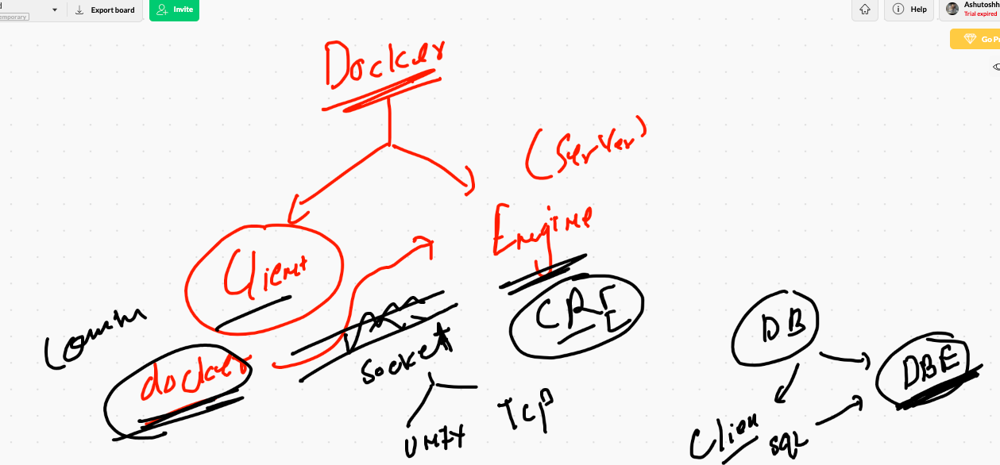

# Docker & k8s


# Hypervison in action 


# Container model engines


## containers


## docker supported kernel 


## docker installation using docker desktop


## Docker desktop for windows 10

[docker desktop] ('https://hub.docker.com/editions/community/docker-ce-desktop-windows/')


## docker desktop for mac 

[dd] ('https://hub.docker.com/editions/community/docker-ce-desktop-mac')


## docker ce installation in linux directly 

[install docker] ('https://docs.docker.com/engine/install/centos/')

## docker installation on linux

```
[root@ip-172-31-66-188 ~]# yum install docker 
Failed to set locale, defaulting to C
Loaded plugins: extras_suggestions, langpacks, priorities, update-motd
amzn2-core                                                         | 3.7 kB  00:00:00     
Resolving Dependencies
--> Running transaction check
---> Package docker.x86_64 0:19.03.13ce-1.amzn2 will be installed
--> Processing Dependency: runc >= 1.0.0 for package: docker-19.03.13ce-1.amzn2.x86_64
--> Processing Dependency: containerd >= 1.3.2 for package: docker-19.03.13ce-1.amzn2.x86_64

```

## starting docker 

```
[root@ip-172-31-66-188 ~]# systemctl  start  docker 
[root@ip-172-31-66-188 ~]# systemctl enable  docker 
Created symlink from /etc/systemd/system/multi-user.target.wants/docker.service to /usr/lib/systemd/system/docker.service.
[root@ip-172-31-66-188 ~]# systemctl  status  docker 
● docker.service - Docker Application Container Engine
   Loaded: loaded (/usr/lib/systemd/system/docker.service; enabled; vendor preset: disabled)
   Active: active (running) since Wed 2020-12-16 05:21:13 UTC; 14s ago
     Docs: https://docs.docker.com
 Main PID: 32722 (dockerd)
   CGroup: /system.slice/docker.service
           └─32722 /usr/bin/dockerd -H fd:// --containerd=/run/containerd/containerd.so...

Dec 16 05:21:12 ip-172-31-66-188.ec2.internal dockerd[32722]: time="2020-12-16T05:21:12...
Dec 16 05:21:12 ip-172-31-66-188.ec2.internal dockerd[32722]: time="2020-12-16T05:21:12...
Dec 16 05:21:12 ip-172-31-66-188.ec2.internal dockerd[32722]: time="2020-12-16T05:21:12...
Dec 16 05:21:12 ip-172-31-66-188.ec2.internal

```

## docker architecture 



## adding users in docker group

```
[root@ip-172-31-66-188 ~]# for  i  in  `ls  /home`
> do
> usermod -aG docker $i
> done

```

## connecting with docker engine

```
[ec2-user@ip-172-31-66-188 ~]$ docker version 
Client:
 Version:           19.03.13-ce
 API version:       1.40
 Go version:        go1.13.15
 Git commit:        4484c46
 Built:             Mon Oct 12 18:51:20 2020
 OS/Arch:           linux/amd64
 Experimental:      false

Server:
 Engine:
  Version:          19.03.13-ce
  API version:      1.40 (minimum version 1.12)
  Go version:       go1.13.15
  Git commit:       4484c46
  Built:            Mon Oct 12 18:51:50 2020
  OS/Arch:          linux/amd64
  Experimental:     false
 containerd:

```

## summary so far


## image registry 


## searching image on docker hub 

```
[ec2-user@ip-172-31-66-188 ~]$ docker  search  mysql 
NAME                              DESCRIPTION                                     STARS               OFFICIAL            AUTOMATED
mysql                             MySQL is a widely used, open-source relation…   10269               [OK]                
mariadb                           MariaDB is a community-developed fork of MyS…   3794                [OK]                
mysql/mysql-server                Optimized MySQL Server Docker images. Create…   749                                     [OK]
percona                           Percona Server is a fork of the MySQL relati…   515                 [OK]                
centos/mysql-57-centos7           MySQL 5.7 SQL database server                   86                                      
mysql/mysql-cluster               

```

## checking images

```
[ec2-user@ip-172-31-66-188 ~]$ docker  images
REPOSITORY          TAG                 IMAGE ID            CREATED             SIZE


```

## container creation process


## first container creation 

```
[ec2-user@ip-172-31-66-188 ~]$ docker  run  alpine:latest  ping fb.com 
PING fb.com (31.13.66.35): 56 data bytes
64 bytes from 31.13.66.35: seq=0 ttl=51 time=0.719 ms
64 bytes from 31.13.66.35: seq=1 ttl=51 time=0.757 ms
64 bytes from 31.13.66.35: seq=2 ttl=51 time=0.776 ms
64 bytes from 31.13.66.35: seq=3 ttl=51 time=0.736 ms

```

## container with background process

```
docker  run  --name  ashuc1 -d  alpine  ping 8.8.8.8
```

## checking running container list 

```
[ec2-user@ip-172-31-66-188 ~]$ docker ps
CONTAINER ID        IMAGE               COMMAND             CREATED              STATUS              PORTS               NAMES
8d1163736bb8        alpine              "ping 8.8.8.8"      About a minute ago   Up About a minute                       raj1
9e8e95e870d1        alpine              "ping 8.8.8.8"      2 minutes ago        Up 2 minutes                            amardc1
84b09117c6ed        alpine              "ping google.com"   2 minutes ago        Up 2 minutes                            ramya_test
3347432234bc        alpine              "ping 8.8.8.8"      3 minutes ago        Up 2 minutes                            som1
b01dab207aa8        alpine              "ping google.com"   3 minutes ago        Up 3

```
## checking output of container

```
50  docker  logs  ashuc1 
   51  docker  logs -f  ashuc1 
   
```


## more docker operations

```
 14  docker   stop  ashuc1
   15  docker  ps
   16  docker  ps -a
   17  history 
   18  docker  start  ashuc1
   19  docker  ps
   20  docker  kill  ashuc1
   21  docker  ps
   22  docker  start  ashuc1
   23  docker  ps

```

## cleaning up all the containers

```
[ec2-user@ip-172-31-66-188 ~]$ docker kill  $(docker ps  -q)
5b961130d22f
4f9733727187
8d1163736bb8
f426c78d48f3
[ec2-user@ip-172-31-66-188 ~]$ docker  ps
CONTAINER ID        IMAGE               COMMAND             CREATED             STATUS              PORTS               NAMES
[ec2-user@ip-172-31-66-188 ~]$ docker rm  $(docker ps  -q -a)
5b961130d22f
4f9733727187
8d1163736bb8
9e8e95e870d1
3347432234bc
b01dab207aa8
265c771eac65
f426c78d48f3
22212073cac9
44db9a7e3796
89c0ed5a86ce
[ec2-user@ip-172-31-66-188 ~]$ docker  ps  -a
CONTAINER ID        IMAGE               COMMAND             CREATED             STATUS              PORTS               NAMES
[ec2-user@ip-172-31-66-188 ~]$ 


```


   
## container child process

```
[ec2-user@ip-172-31-66-188 ~]$ docker  exec  -it  ashux1  sh 
/ # 
/ # 
/ # ls
bin    dev    etc    home   lib    media  mnt    opt    proc   root   run    sbin   srv    sys    tmp    usr    var
/ # uname 
Linux
/ # uname -r
4.14.203-156.332.amzn2.x86_64
/ # cat  /etc/os-release 
NAME="Alpine Linux"
ID=alpine
VERSION_ID=3.12.2
PRETTY_NAME="Alpine Linux v3.12"
HOME_URL="https://alpinelinux.org/"
BUG_REPORT_URL="https://bugs.alpinelinux.org/"

```

##

```
 44  docker  exec  ashux1  uname  
   45  docker  exec  ashux1 "uname -r"
   46  docker  exec  ashux1  ping google.com
   47  docker  ps
   48  docker  exec  ashux1 uname -r
   49  uname -r
   50  history 
   51  docker  exec  -d ashux1  ping google.com

```
   
   
## Docker image building process


## sample python script

```
import time,subprocess

while 3 > 2:
    print("Hello world")
    noc=subprocess.getoutput("docker ps ")
    time.sleep(2)
    print("all containers ",noc)
    print("________________________")
    print("________________________")
    time.sleep(2)

```

## dockerfile

```
[ec2-user@ip-172-31-66-188 pyapp]$ cat Dockerfile 
FROM  python
# we are telling docker engine to use python as base image
# if it is not present in your system it will pull it from docker hub
MAINTAINER  ashutoshh@linux.com , ashutoshh singh 
# info about dockerfile creator
# optional step 
RUN  mkdir  /mycode
# inside container if something i want to perform 
COPY  hello.py  /mycode/hello.py
# take data from localhost and copy it to docker image during building time 
# only current location data will be considered 
WORKDIR  /mycode
# changing directory during build time 
RUN chmod +x hello.py
CMD  ["python","hello.py"]
# cmd will be used to decide the default parent process for my docker image 

```

## bulding image

```
[ec2-user@ip-172-31-66-188 pyapp]$ docker  build  -t  ashu:pyv1  . 
Sending build context to Docker daemon  3.584kB
Step 1/7 : FROM  python
latest: Pulling from library/python
6c33745f49b4: Pull complete 
c87cd3c61e27: Pull complete 
05a3c799ec37: Pull complete 
a61c38f966ac: Pull complete 
c2dd6d195b68: Pull complete 
29b9446ae7bd: Pull complete 
09cf96c794f9: Pull complete 
f674fd97fba7: Pull complete 
9c7f9d05b1c1: Pull complete 
Digest: sha256:54f6f8b98d982f5b88f22f8d0cbed67a762d7b1ceffcc9a0dedfc30a639dffa8
Status: Downloaded newer image for python:latest
 ---> 2770b69c10e1
Step 2/7 : MAINTAINER  ashutoshh@linux.com , ashutoshh singh
 ---> Running in bdaf3497ef11
Removing intermediate container bdaf3497ef11
 ---> 7dde1f21818a
Step 3/7 : RUN  mkdir  /mycode
 ---> Running in 716ce9c3c1e2
Removing intermediate container 716ce9c3c1e2
 ---> 9bb721b372b2
Step 4/7 : COPY  hello.py  /mycode/hello.

```
