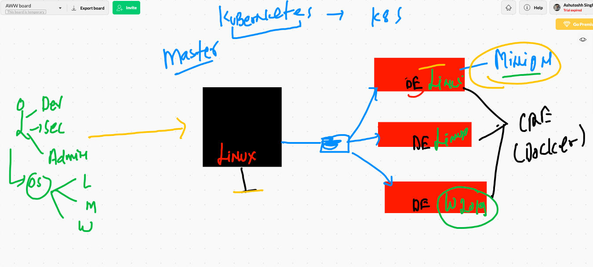

# Docker & k8s

## Docker tcp socket 

```
ec2-user@ip-172-31-66-188 ~]$ cd /etc/sysconfig/
[ec2-user@ip-172-31-66-188 sysconfig]$ ls
acpid       clock     docker          i18n        man-db      network-scripts  readonly-root  rsyslog    sysstat
atd         console   docker-storage  init        modules     nfs              rpc-rquotad    run-parts  sysstat.ioconf
authconfig  cpupower  grub            irqbalance  netconsole  raid-check       rpcbind        selinux
chronyd     crond     htcacheclean    keyboard    network     rdisc            rsyncd         sshd
[ec2-user@ip-172-31-66-188 sysconfig]$ sudo vim docker
[ec2-user@ip-172-31-66-188 sysconfig]$ cat  docker
# The max number of open files for the daemon itself, and all
# running containers.  The default value of 1048576 mirrors the value
# used by the systemd service unit.
DAEMON_MAXFILES=1048576

# Additional startup options for the Docker daemon, for example:
# OPTIONS="--ip-forward=true --iptables=true"
# By default we limit the number of open files per container
OPTIONS="--default-ulimit nofile=1024:4096 -g /var/lib/oracledocker -H tcp://0.0.0.0:2375 -H unix:///var/run/docker.sock"

# How many seconds the sysvinit script waits for the pidfile to appear
# when starting the daemon.
DAEMON_PIDFILE_TIMEOUT=10
[ec2-user@ip-172-31-66-188 sysconfig]$ sudo systemctl daemon-reload 
[ec2-user@ip-172-31-66-188 sysconfig]$ sudo systemctl restart docker
[ec2-user@ip-172-31-66-188 sysconfig]$ sudo netstat -ntpl  |  grep -i docker
tcp6       0      0 :::2375                 :::*                    LISTEN      5858/dockerd 

```

## COnnecting docker remote engine from mac 

```
 export DOCKER_HOST="tcp://34.233.20.87:2375"
```

## From windows powershell

```
$env:DOCKER_HOST="tcp://34.233.20.87:2375"

```

## DB in container

```
[ec2-user@ip-172-31-66-188 ~]$ docker run -d --name ashudb -e MYSQL_ROOT_PASSWORD=oracle123  mysql 

==
[ec2-user@ip-172-31-66-188 ~]$ docker  exec  -it  ashudb bash 
root@9d4543ad32f4:/# cat  /etc/os-release 
PRETTY_NAME="Debian GNU/Linux 10 (buster)"
NAME="Debian GNU/Linux"
VERSION_ID="10"
VERSION="10 (buster)"
VERSION_CODENAME=buster
ID=debian
HOME_URL="https://www.debian.org/"
SUPPORT_URL="https://www.debian.org/support"
BUG_REPORT_URL="https://bugs.debian.org/"
root@9d4543ad32f4:/# mysql -u root  -p
Enter password: 
Welcome to the MySQL monitor.  Commands end with ; or \g.
Your MySQL connection id is 8
Server version: 8.0.22 MySQL Community Server - GPL

Copyright (c) 2000, 2020, Oracle and/or its affiliates. All rights reserved.

Oracle is a registered trademark of Oracle Corporation and/or its
affiliates. Other names may be trademarks of their respective
owners.

Type 'help;' or '\h' for help. Type '\c' to clear the current input statement.

mysql> 

---
mysql> show databases;
+--------------------+
| Database           |
+--------------------+
| information_schema |
| mysql              |
| performance_schema |
| sys                |
+--------------------+
4 rows in set (0.00 sec)


```
## adminer and mysql 

```
[ec2-user@ip-172-31-66-188 ashuapp]$ cat docker-compose.yml 
# Use root/example as user/password credentials
version: '3.8'

services:

  ashudb:
    image: mysql
    command: --default-authentication-plugin=mysql_native_password
    restart: always
    environment:
      MYSQL_ROOT_PASSWORD: oracle

  ashuadminer:
    image: adminer
    restart: always
    depends_on:
     - ashudb
    ports:
      - 1234:8080
      
 ```
 
# COntainer problems


## container orchestration tool


# Kubernetes 


## k8s client - master - minion 



##  k8s apiserver


## node controller and kube schedular 


## etcd in k8s


## Network bridge on minion side for all containerized applications


## kube-proxy for containers communication 


# Minikube installation 

[minikube] ('https://minikube.sigs.k8s.io/docs/start/')

## minikube start

```
❯ minikube version
minikube version: v1.16.0
commit: 9f1e482427589ff8451c4723b6ba53bb9742fbb1
❯ minikube start --driver=docker
😄  minikube v1.16.0 on Darwin 11.0.1
🆕  Kubernetes 1.20.0 is now available. If you would like to upgrade, specify: --kubernetes-version=v1.20.0
✨  Using the docker driver based on existing profile
👍  Starting control plane node minikube in cluster minikube
🚜  Pulling base image ...
💾  Downloading Kubernetes v1.19.4 preload ...
    > preloaded-images-k8s-v8-v1....: 21.22 MiB
    
  ```
  
# k8s cluster installation methods


# kubectl installation 

## installation on Mac os

```
❯ curl -LO "https://storage.googleapis.com/kubernetes-release/release/$(curl -s https://storage.googleapis.com/kubernetes-release/release/stable.txt)/bin/darwin/amd64/kubectl"
  % Total    % Received % Xferd  Average Speed   Time    Time     Time  Current
                                 Dload  Upload   Total   Spent    Left  Speed
100 44.0M  100 44.0M    0     0  2096k      0  0:00:21  0:00:21 --:--:-- 2278k
❯ chmod +x ./kubectl
❯ sudo mv ./kubectl /usr/local/bin/kubectl
Password:
❯ kubectl version --client
Client Version: version.Info{Major:"1", Minor:"20", GitVersion:"v1.20.0", GitCommit:"af46c47ce925f4c4ad5cc8d1fca46c7b77d13b38", GitTreeState:"clean", BuildDate:"2020-12-08T17:59:43Z", GoVersion:"go1.15.5", Compiler:"gc", Platform:"darwin/amd64"}


```

## app deployment model


## intro to POD


# kubernetes token file on master node

```
[ec2-user@ip-172-31-74-3 ~]$ cd /etc/kubernetes/
[ec2-user@ip-172-31-74-3 kubernetes]$ ls
admin.conf 

```


## Connecting from client 

```
❯ kubectl get nodes --kubeconfig admin.conf
NAME                            STATUS   ROLES                  AGE     VERSION
ip-172-31-73-69.ec2.internal    Ready    <none>                 5h42m   v1.20.0
ip-172-31-74-3.ec2.internal     Ready    control-plane,master   5h45m   v1.20.0
ip-172-31-76-165.ec2.internal   Ready    <none>                 5h42m   v1.20.0
ip-172-31-77-52.ec2.internal    Ready    <none>                 5h42m   v1.20.0


```

## setting admin.conf under home directory 

```
❯ whoami
fire
❯ echo $HOME
/Users/fire
❯ mkdir  /Users/fire/.kube
mkdir: /Users/fire/.kube: File exists
❯ cp -v admin.conf /Users/fire/.kube/config
admin.conf -> /Users/fire/.kube/config
❯ 
❯ kubectl get  nodes
NAME                            STATUS   ROLES                  AGE     VERSION
ip-172-31-73-69.ec2.internal    Ready    <none>                 5h47m   v1.20.0
ip-172-31-74-3.ec2.internal     Ready    control-plane,master   5h50m   v1.20.0
ip-172-31-76-165.ec2.internal   Ready    <none>                 5h47m   v1.20.0
ip-172-31-77-52.ec2.internal    Ready    <none>                 5h47m   v1.20.0

```

