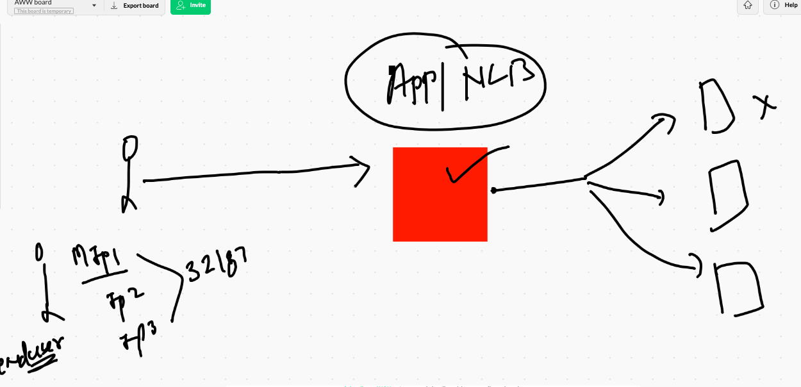

# Docker & k8s

## Docker swarm 


## swarm vs k8s


## Namespaces


```
❯ kubectl  get  ns
NAME              STATUS   AGE
default           Active   4d
kube-node-lease   Active   4d
kube-public       Active   4d
kube-system       Active   4d

```

## kube-system 

```
❯ kubectl   get  po  -n kube-system
NAME                                                  READY   STATUS    RESTARTS   AGE
calico-kube-controllers-744cfdf676-2r4v4              1/1     Running   1          4d
calico-node-8gjwg                                     1/1     Running   1          4d
calico-node-bvm66                                     1/1     Running   1          4d
calico-node-gqx7h                                     1/1     Running   1          4d
calico-node-lvhzs                                     1/1     Running   1          4d
coredns-74ff55c5b-bs5gg                    

```


## creating namespace

```
❯ kubectl  create namespace  ashu-space
namespace/ashu-space created
❯ kubectl  get  ns
NAME              STATUS   AGE
abhi-ns           Active   2m8s
amx-ns            Active   48s
ashu-space        Active   6s

```

## defining namespace in YAML

```
apiVersion: v1
kind: ReplicationController
metadata:
 namespace: ashu-space 
 name: ashu-app-1
 labels:  # label of RC not of POD
  x: helloashu


```
###

```
❯ kubectl apply -f ashu-rc.yml -n ashu-space
replicationcontroller/ashu-app-1 created
❯ kubectl get  rc -n ashu-space
NAME         DESIRED   CURRENT   READY   AGE
ashu-app-1   4         4         4       9s
❯ kubectl get  po  -n ashu-space
NAME               READY   STATUS    RESTARTS   AGE
ashu-app-1-4fjdr   1/1     Running   0          33s
ashu-app-1-7nmzq   1/1     Running   0          33s
ashu-app-1-bc85w   1/1     Running   0          33s
ashu-app-1-hr6bn   1/1     Running   0          33s
❯ kubectl expose rc  ashu-app-1 --type NodePort --port 1234 --target-port 80 --name myashusvc -n ashu-space
service/myashusvc exposed
❯ 
❯ kubectl get svc -n ashu-space
NAME        TYPE       CLUSTER-IP     EXTERNAL-IP   PORT(S)          AGE
myashusvc   NodePort   10.101.98.70   <none>        1234:30015/TCP   11s


```

## all in mynamespace

```
❯ kubectl get all -n ashu-space
NAME                   READY   STATUS    RESTARTS   AGE
pod/ashu-app-1-4fjdr   1/1     Running   0          2m36s
pod/ashu-app-1-7nmzq   1/1     Running   0          2m36s
pod/ashu-app-1-bc85w   1/1     Running   0          2m36s
pod/ashu-app-1-hr6bn   1/1     Running   0          2m36s

NAME                               DESIRED   CURRENT   READY   AGE
replicationcontroller/ashu-app-1   4         4         4       2m36s

NAME                TYPE       CLUSTER-IP     EXTERNAL-IP   PORT(S)          AGE
service/myashusvc   NodePort   10.101.98.70   <none>        1234:30015/TCP   89s

```


## RC vs RS


## Deployment


## flask app deployment 

```
kubectl   create deployment ashuflaskapp --image=dockerashu/flaskapp:v001 --namespace #-space  --dry-run=client    -o yaml  >ashuflaskdep.yml
```

## Deployment 

```
❯ kubectl apply -f  ashuflaskdep.yml
deployment.apps/ashuflaskapp created
❯ kubectl get  deployment  -n ashu-space
NAME           READY   UP-TO-DATE   AVAILABLE   AGE
ashuflaskapp   1/1     1            1           13s
❯ kubectl get  deployments  -n ashu-space
NAME           READY   UP-TO-DATE   AVAILABLE   AGE
ashuflaskapp   1/1     1            1           17s
❯ 
❯ kubectl get  deploy  -n ashu-space
NAME           READY   UP-TO-DATE   AVAILABLE   AGE
ashuflaskapp   1/1     1            1           23s
❯ kubectl get  rs  -n ashu-space
NAME                     DESIRED   CURRENT   READY   AGE
ashuflaskapp-d4ff646b8   1         1         1       34s
❯ kubectl get po   -n ashu-space
NAME                           READY   STATUS    RESTARTS   AGE
ashuflaskapp-d4ff646b8-rw7mt   1/1     Running   0          43s

```

## Creating service by Expose 

```
❯ kubectl get  deploy -n ashu-space
NAME           READY   UP-TO-DATE   AVAILABLE   AGE
ashuflaskapp   1/1     1            1           4m26s
❯ kubectl  expose deployment ashuflaskapp  --type NodePort --port 1234 --target-port 5000 --name myflasksvc -n ashu-space
service/myflasksvc exposed
❯ kubectl get svc -n ashu-space
NAME         TYPE       CLUSTER-IP       EXTERNAL-IP   PORT(S)          AGE
myflasksvc   NodePort   10.101.101.103   <none>        1234:32133/TCP   7s

```

## scaling deployment 

```
❯ kubectl scale deployment ashuflaskapp  --replicas=3  -n ashu-space
deployment.apps/ashuflaskapp scaled
❯ kubectl  get deploy -n ashu-space
NAME           READY   UP-TO-DATE   AVAILABLE   AGE
ashuflaskapp   3/3     3            3           14m

```

## Deployment process flow


## checking revision number 

```
❯ kubectl describe  deploy ashuflaskapp   -n ashu-space
Name:                   ashuflaskapp
Namespace:              ashu-space
CreationTimestamp:      Tue, 22 Dec 2020 10:18:21 +0530
Labels:                 app=ashuflaskapp
Annotations:            deployment.kubernetes.io/revision: 1

```
## checking version history 

```
❯ kubectl  rollout history deployment  ashuflaskapp  -n ashu-space
deployment.apps/ashuflaskapp 
REVISION  CHANGE-CAUSE
1         <none>


```


## more deployments commands

```
2631  kubectl describe  deploy ashuflaskapp   -n ashu-space 
 2632  kubectl  set  image deployment ashuflaskapp  flaskapp=dockerashu/flaskapp:v002 -n ashu-space 
 2633  kubectl  rollout status  deployment  ashuflaskapp  -n ashu-space 
 2634  kubectl  rollout history   deployment  ashuflaskapp  -n ashu-space 
 2635  kubectl describe  deploy ashuflaskapp   -n ashu-space 
 
```

## Private registry based application deployment 
## azure container registry 


## push image on azure container registry 

```
 41  docker  build  -t  app:v1  https://github.com/redashu/ocnginx_html.git 
   42  docker  images
   43  docker  tag   app:v1   ashutoshh.azurecr.io/app:v1  
   44  docker  login  ashutoshh.azurecr.io 
   45  docker  push    ashutoshh.azurecr.io/app:v1  
   46  docker  logout   ashutoshh.azurecr.io 
   
  ```
  
  
  ## Deployment file creation 
  
  ```
  kubectl  create deployment  azureapp --image=ashutoshh.azurecr.io/app:v1  --namespace ashu-space --dry-run=client -o  yaml  >azureapp.yml
  
  ```
  
  ## ERROR in pulling private registry image
  
  ```
   2643  kubectl apply -f  azureapp.yml
 2644  kubectl  get  deploy -n ashu-space 
 2645  kubectl  get po  -n ashu-space 
 2646  kubectl describe  pod  azureapp-7bf6988549-lrxbq   -n ashu-space 
❯ kubectl  get po  -n ashu-space
NAME                        READY   STATUS             RESTARTS   AGE
azureapp-7bf6988549-lrxbq   0/1     ImagePullBackOff   0          102s

```

## Secrets in k8s 


## creating docker secret

```
kubectl  create secret  docker-registry  ashuimg --docker-username=ashutoshh  --docker-password==L3V/tihOTUb4YiuLqKfh7c6mVNT6GJi  --docker-server=ashutoshh.azurecr.io  -n ashu-space

```

## azure app 

```
❯ cat  azureapp.yml
apiVersion: apps/v1
kind: Deployment
metadata:
  creationTimestamp: null
  labels:
    app: azureapp
  name: azureapp
  namespace: ashu-space
spec:
  replicas: 1
  selector:
    matchLabels:
      app: azureapp
  strategy: {}
  template:
    metadata:
      creationTimestamp: null
      labels:
        app: azureapp
    spec:
      imagePullSecrets:  # keyword to define secret of docker image type 
      - name: ashuimg # name of secret 
      containers:
      - image: ashutoshh.azurecr.io/app:v1
        name: app
        resources: {}
        
  ```
  
  ## creating loadbalancer service 
  
  ```
  ❯ kubectl expose  deployment azureapp --type LoadBalancer --port 1122 --target-port 80 --name aasvc -n ashu-space
service/aasvc exposed
❯ kubectl get svc -n ashu-space
NAME    TYPE           CLUSTER-IP       EXTERNAL-IP   PORT(S)          AGE
aasvc   LoadBalancer   10.101.137.202   <pending>     1122:32187/TCP   9s

```

## service with loadbalancer 



# Storage in K8s 


## volume url

['volumes in k8s'] ('https://kubernetes.io/docs/concepts/storage/volumes/')

## volume options 


## EmptyDir volume 

```
kubectl  run  ashupod11 --image=alpine --restart=Never  --dry-run=client -o yaml >empvol.yml

```

## adding emptydir vol

```
apiVersion: v1
kind: Pod
metadata:
  creationTimestamp: null
  labels:
    run: ashupod11
  name: ashupod11
spec:
  volumes:  # to create any type of  volume during POd creation 
  - name: ashuvol1  # name of volume 
    emptyDir: {}  # will take from random location on the minion node
  containers:
  - image: alpine
    name: ashupod11
    volumeMounts:
    - name: ashuvol1  # same volume we create above 
      mountPath: /mnt/data  # this will created in the POD 
    command: ["/bin/sh","-c","while true;do date >>/mnt/data/time.txt;sleep 3;done"]
    resources: {}
  dnsPolicy: ClusterFirst
  restartPolicy: Never
status: {}

```

## deployment 

```
❯ kubectl apply -f empvol.yml -n ashu-space
pod/ashupod11 created
❯ 
❯ kubectl  get  po -n ashu-space
NAME        READY   STATUS    RESTARTS   AGE
ashupod11   1/1     Running   0          12s
❯ kubectl exec -it  ashupod11 -n ashu-space -- sh
/ # ls
bin    etc    lib    mnt    proc   run    srv    tmp    var
dev    home   media  opt    root   sbin   sys    usr
/ # cd  /mnt/data/
/mnt/data # ls
time.txt
/mnt/data # cat  time.txt 
Tue Dec 22 06:50:10 UTC 2020
Tue Dec 22 06:50:13 UTC 2020
Tue Dec 22 06:50:16 UTC 2020
Tue Dec 22 06:50:19 UTC 2020
Tue Dec 22 06:50:22 UTC 2020

```

## multi container pod

```
❯ cat empvol.yml
apiVersion: v1
kind: Pod
metadata:
  creationTimestamp: null
  labels:
    run: ashupod11
  name: ashupod11
spec:
  volumes:  # to create any type of  volume during POd creation 
  - name: ashuvol1  # name of volume 
    emptyDir: {}  # will take from random location on the minion node
  containers:
  - image: alpine
    name: ashupod11
    volumeMounts:
    - name: ashuvol1  # same volume we create above 
      mountPath: /mnt/data  # this will created in the POD
    command: ["/bin/sh","-c","while true;do date >>/mnt/data/index.html;sleep 3;done"]
 
  - image: nginx
    name: ashux1
    volumeMounts:
    - name: ashuvol1
      mountPath: /usr/share/nginx/html/
    ports:
    - containerPort: 80
    resources: {}
  dnsPolicy: ClusterFirst
  restartPolicy: Never
status: {}


```


# Portainer 

## portianer deployment 

```
 kubectl  create deployment minion2dep --image=portainer/portainer  --dry-run=client -o yaml >portainer.yml
 
 ===
 
 
 
 ❯ cat portainer.yml
apiVersion: apps/v1
kind: Deployment
metadata:
  creationTimestamp: null
  labels:
    app: minion2dep
  name: minion2dep
  namespace: ashu-space 
spec:
  replicas: 1
  selector:
    matchLabels:
      app: minion2dep
  strategy: {}
  template:
    metadata:
      creationTimestamp: null
      labels:
        app: minion2dep
    spec:
      nodeName: ip-172-31-76-165.ec2.internal  # manual scheduling 
      volumes:
      - name: ashuvolx1
        hostPath:
         path: /var/run/docker.sock
         type: Socket 
      containers:
      - image: portainer/portainer
        name: portainer
        ports:
        - containerPort: 9000
        volumeMounts:
        - name: ashuvolx1
          mountPath: /var/run/docker.sock 
        resources: {}
        
    ======
    ❯ kubectl apply -f portainer.yml -n ashu-space
deployment.apps/minion2dep created
❯ kubectl get deploy -n ashu-space
NAME         READY   UP-TO-DATE   AVAILABLE   AGE
minion2dep   1/1     1            1           8s
❯ kubectl expose deployment minion2dep  --type NodePort --port 1234 --target-port 9000 -n ashu-space
service/minion2dep exposed
❯ kubectl get  svc -n ashu-space
NAME         TYPE       CLUSTER-IP      EXTERNAL-IP   PORT(S)          AGE
minion2dep   NodePort   10.99.147.244   <none>        1234:32547/TCP   10s


```

# wordpress deployment 

## DB yaml v1 ---

```
❯ cat wpdb.yml
apiVersion: apps/v1
kind: Deployment
metadata:
  creationTimestamp: null
  labels:
    app: ashudb
  name: ashudb
  namespace: ashu-space 
spec:
  replicas: 1
  selector:
    matchLabels:
      app: ashudb
  strategy: {}
  template:
    metadata:
      creationTimestamp: null
      labels:
        app: ashudb
    spec:
      volumes: # to store db remotely and persistently 
      - name: ashudbvol1
        nfs:
         server: 172.31.28.41  # nfs server IP 
         path: /db/ashu # storage location on NFS server 
      containers:
      - image: mysql:5.6
        name: mysql
        volumeMounts:
        - name: ashudbvol1 
          mountPath: /var/lib/mysql/ # path where are table will be stored 
        resources: {}
        
  ```
  
  ## creating secret for db root password 
  
  ```
  ❯ kubectl  create secret  generic  ashudbsec  --from-literal  pw=oracle12345 -n ashu-space
secret/ashudbsec created
❯ kubectl  get  secret  -n ashu-space
NAME                  TYPE                                  DATA   AGE
ashudbsec             Opaque                                1      11s
ashuimg               kubernetes.io/dockerconfigjson        1      163m
default-token-dj5kt   kubernetes.io/service-account-token   3      4h46m


```

## WP db file version 2

```
❯ cat  wpdb.yml
apiVersion: apps/v1
kind: Deployment
metadata:
  creationTimestamp: null
  labels:
    app: ashudb
  name: ashudb
  namespace: ashu-space 
spec:
  replicas: 1
  selector:
    matchLabels:
      app: ashudb
  strategy: {}
  template:
    metadata:
      creationTimestamp: null
      labels:
        app: ashudb
    spec:
      volumes: # to store db remotely and persistently 
      - name: ashudbvol1
        nfs:
         server: 172.31.28.41  # nfs server IP 
         path: /db/ashu # storage location on NFS server 
      containers:
      - image: mysql:5.6
        name: mysql
        volumeMounts:
        - name: ashudbvol1 
          mountPath: /var/lib/mysql/ # path where are table will be stored 
        env:
        - name: MYSQL_ROOT_PASSWORD
          valueFrom:
           secretKeyRef:  # keyword to use secret 
            name: ashudbsec  # name of secret
            key: pw  # key of sec
        resources: {}
        
  ```
  
  
## creating service for Db 

```
 kubectl create  service clusterip  ashudbsvc --tcp 1234:3306  --dry-run=client -o yaml
apiVersion: v1
kind: Service
metadata:
  creationTimestamp: null
  labels:
    app: ashudbsvc
  name: ashudbsvc
spec:
  ports:
  - name: 1234-3306
    port: 1234
    protocol: TCP
    targetPort: 3306
  selector:
    app: ashudbsvc
  type: ClusterIP
status:
  loadBalancer: {}
❯ kubectl create  service clusterip  ashudbsvc --tcp 1234:3306  --dry-run=client -o yaml  >>wpdb.yml

```

## DB yaml version 3

```
❯ cat wpdb.yml
apiVersion: apps/v1
kind: Deployment
metadata:
  creationTimestamp: null
  labels:
    app: ashudb
  name: ashudb
  namespace: ashu-space 
spec:
  replicas: 1
  selector:
    matchLabels:
      app: ashudb
  strategy: {}
  template:
    metadata:
      creationTimestamp: null
      labels:
        app: ashudb
    spec:
      volumes: # to store db remotely and persistently 
      - name: ashudbvol1
        nfs:
         server: 172.31.28.41  # nfs server IP 
         path: /db/ashu # storage location on NFS server 
      containers:
      - image: mysql:5.6
        name: mysql
        volumeMounts:
        - name: ashudbvol1 
          mountPath: /var/lib/mysql/ # path where are table will be stored 
        env:
        - name: MYSQL_ROOT_PASSWORD
          valueFrom:
           secretKeyRef:  # keyword to use secret 
            name: ashudbsec  # name of secret
            key: pw  # key of sec
        resources: {}
status: {}

---

apiVersion: v1
kind: Service
metadata:
  creationTimestamp: null
  labels:
    app: ashudbsvc
  name: ashudbsvc
spec:
  ports:
  - name: 1234-3306
    port: 1234
    protocol: TCP
    targetPort: 3306
  selector:
   app: ashudb # label of POD 
  type: ClusterIP
status:
  loadBalancer: {}
  
```

## appending wordpress web server image in Db yaml 

```
 kubectl  create deployment ashufrontapp --image=wordpress:4.8-apache  --dry-run=client -o yaml >>wpdb.yml
 
 ```
## Version 5 of wordpress Db yaml 

```
❯ cat wpdb.yml
apiVersion: apps/v1
kind: Deployment
metadata:
  creationTimestamp: null
  labels:
    app: ashudb
  name: ashudb
  namespace: ashu-space 
spec:
  replicas: 1
  selector:
    matchLabels:
      app: ashudb
  strategy: {}
  template:
    metadata:
      creationTimestamp: null
      labels:
        app: ashudb
    spec:
      volumes: # to store db remotely and persistently 
      - name: ashudbvol1
        nfs:
         server: 172.31.28.41  # nfs server IP 
         path: /db/ashu # storage location on NFS server 
      containers:
      - image: mysql:5.6
        name: mysql
        volumeMounts:
        - name: ashudbvol1 
          mountPath: /var/lib/mysql/ # path where are table will be stored 
        env:
        - name: MYSQL_ROOT_PASSWORD
          valueFrom:
           secretKeyRef:  # keyword to use secret 
            name: ashudbsec  # name of secret
            key: pw  # key of sec
        resources: {}
status: {}

---

apiVersion: v1
kind: Service
metadata:
  creationTimestamp: null
  labels:
    app: ashudbsvc
  name: ashudbsvc
spec:
  ports:
  - name: 1234-3306
    port: 1234
    protocol: TCP
    targetPort: 3306
  selector:
   app: ashudb # label of POD 
  type: ClusterIP
status:
  loadBalancer: {}

--- 

apiVersion: apps/v1
kind: Deployment
metadata:
  creationTimestamp: null
  labels:
    app: ashufrontapp
  name: ashufrontapp
spec:
  replicas: 1
  selector:
    matchLabels:
      app: ashufrontapp
  strategy: {}
  template:
    metadata:
      creationTimestamp: null
      labels:
        app: ashufrontapp
    spec:
      containers:
      - image: wordpress:4.8-apache
        name: wordpress
        env: # to connect Db few env variables 
        - name: WORDPRESS_DB_HOST
          value: ashudbsvc # service name of DB not POD name of DB 
        - name: WORDPRESS_DB_PASSWORD
          valueFrom:
           secretKeyRef:
            name: ashudbsec
            key: pw 

        resources: {}
status: {}

```

## wordpress flow


## service of wordpress web server

```
kubectl  create service nodeport ashuwebsvc --tcp 1234:80 --dry-run=client -o yaml >>wpdb.yml
```
## final wp yaml file with 2 deployment and 2 services

```
 cat wpdb.yml
apiVersion: apps/v1
kind: Deployment
metadata:
  creationTimestamp: null
  labels:
    app: ashudb
  name: ashudb
  namespace: ashu-space 
spec:
  replicas: 1
  selector:
    matchLabels:
      app: ashudb
  strategy: {}
  template:
    metadata:
      creationTimestamp: null
      labels:
        app: ashudb
    spec:
      volumes: # to store db remotely and persistently 
      - name: ashudbvol1
        nfs:
         server: 172.31.28.41  # nfs server IP 
         path: /db/ashu # storage location on NFS server 
      containers:
      - image: mysql:5.6
        name: mysql
        volumeMounts:
        - name: ashudbvol1 
          mountPath: /var/lib/mysql/ # path where are table will be stored 
        env:
        - name: MYSQL_ROOT_PASSWORD
          valueFrom:
           secretKeyRef:  # keyword to use secret 
            name: ashudbsec  # name of secret
            key: pw  # key of sec
        resources: {}
status: {}

---

apiVersion: v1
kind: Service
metadata:
  creationTimestamp: null
  labels:
    app: ashudbsvc
  name: ashudbsvc
spec:
  ports:
  - name: 1234-3306
    port: 1234
    protocol: TCP
    targetPort: 3306
  selector:
   app: ashudb # label of POD 
  type: ClusterIP
status:
  loadBalancer: {}

--- 

apiVersion: apps/v1
kind: Deployment
metadata:
  creationTimestamp: null
  labels:
    app: ashufrontapp
  name: ashufrontapp
spec:
  replicas: 1
  selector:
    matchLabels:
      app: ashufrontapp
  strategy: {}
  template:
    metadata:
      creationTimestamp: null
      labels:
        app: ashufrontapp
    spec:
      containers:
      - image: wordpress:4.8-apache
        name: wordpress
        env: # to connect Db few env variables 
        - name: WORDPRESS_DB_HOST
          value: ashudbsvc # service name of DB not POD name of DB 
        - name: WORDPRESS_DB_PASSWORD
          valueFrom:
           secretKeyRef:
            name: ashudbsec
            key: pw 

        resources: {}
status: {}

---

apiVersion: v1
kind: Service
metadata:
  creationTimestamp: null
  labels:
    app: ashuwebsvc
  name: ashuwebsvc
spec:
  ports:
  - name: 1234-80
    port: 1234
    protocol: TCP
    targetPort: 80
  selector:
   app: ashufrontapp  # label of POD of web server 
  type: NodePort
status:
  loadBalancer: {}
  
  ```
  
